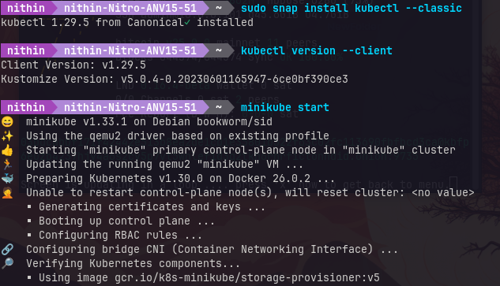
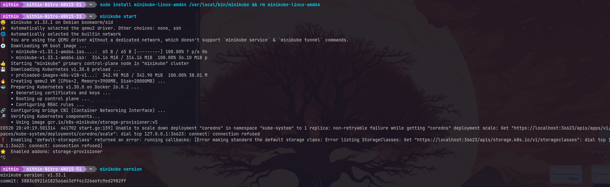

## Run full-stack Ethereum using Docker containers. You are basically using Docker Compose to run the application. 

Video link: https://drive.google.com/file/d/1YWJpZikmxANGz7m1wO3OXOib6LHc_vZy/view

## Install kubernetes  

## Kubernetes Summary

<i>Kubernetes is not really a classic, all-in-one PaaS system. It is built as an infrastructural layer to manage containers, providing but basic container-level services, not as a full-blown PaaS solution, which just happens to use containers as the implementation detail. It includes the ability to deploy, scale, and load balance, with the additional capability of integrating custom logging, monitoring, and alerting solutions. It is modular, avoiding the one-size-fits-all approach of monolithic PaaS systems and replacing it with plug-in freedom. It supports a broad range of workloads: stateless, stateful applications, and data-processing workloads without the requirement to deploy source code or build applications. Organisations should be empowered to decide autonomously on CI/CD workflows according to their cultural and technical needs.

Out of the box, Kubernetes has no support for any application-level service itself: middleware, data-processing frameworks, databases, caches, or any other clustered storage systems. All that stuff can run on Kubernetes and be consumed by applications using portable APIs in much the same way the Open Service Broker provides. Kubernetes is likewise not prescriptive, in that it offers no logging, monitoring, or alerting solutions of its own, rather it does offer native integrations and support mechanisms that allow you to declare what metrics to collect and export.

Additionally, Kubernetes does not enforce or specify a configuration language or system, such as Jsonnet; it also does not offer full machine configuration, maintenance, management, and self-healing systems. It is meant to kill the need for orchestration because it is composed of a collection of independent but composable control processes that continuously drive the existing state towards the desired state. This brings along high flexibility and fault tolerance, canceling out the need for centralized control.

Basically, Kubernetes is a platform that encourages users' delivery upon choice while maintaining flexibility with the right abstractions of the base to manage their applications.</i>