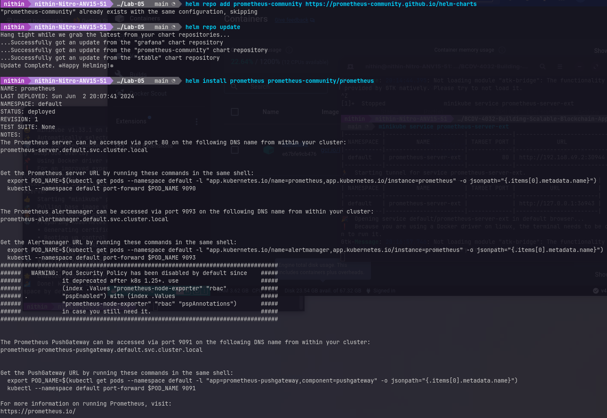
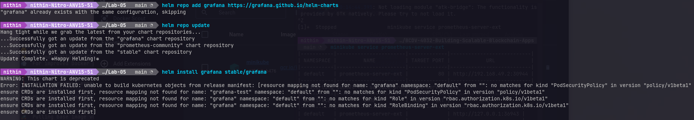
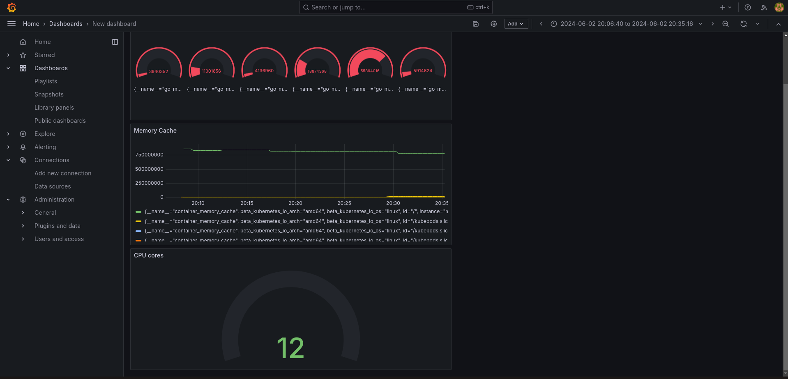

## Prometheus installation
```bash
helm repo add prometheus-community https://prometheus-community.github.io/helm-charts
helm repo update
helm install prometheus prometheus-community/prometheus
kubectl expose service prometheus-server --type=NodePort --target-port=9090 --name=prometheus-server-ext
minikube service prometheus-server-ext
```

## Grafana installation
```bash
helm repo add grafana https://grafana.github.io/helm-charts
helm repo update
helm install grafana stable/grafana
kubectl expose service grafana --type=NodePort --target-port=3000 --name=grafana-ext
minikube service grafana-ext
```

## Grafana dashboard
